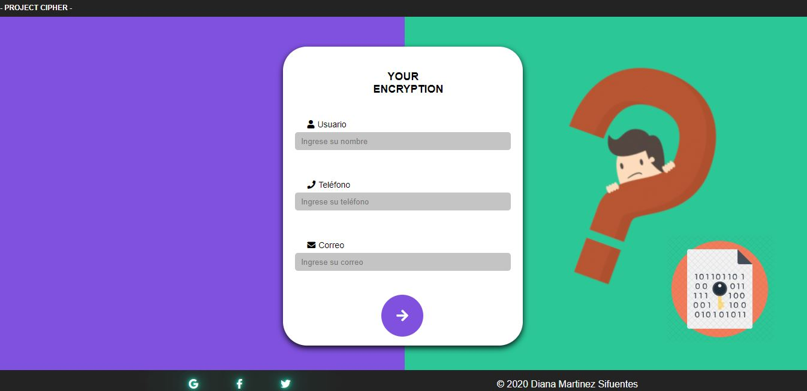
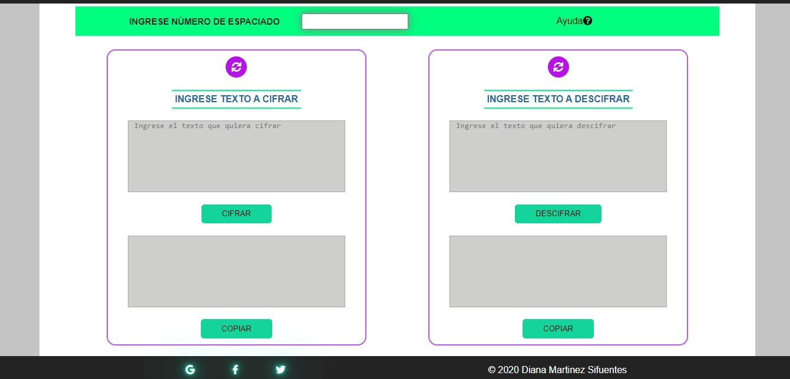
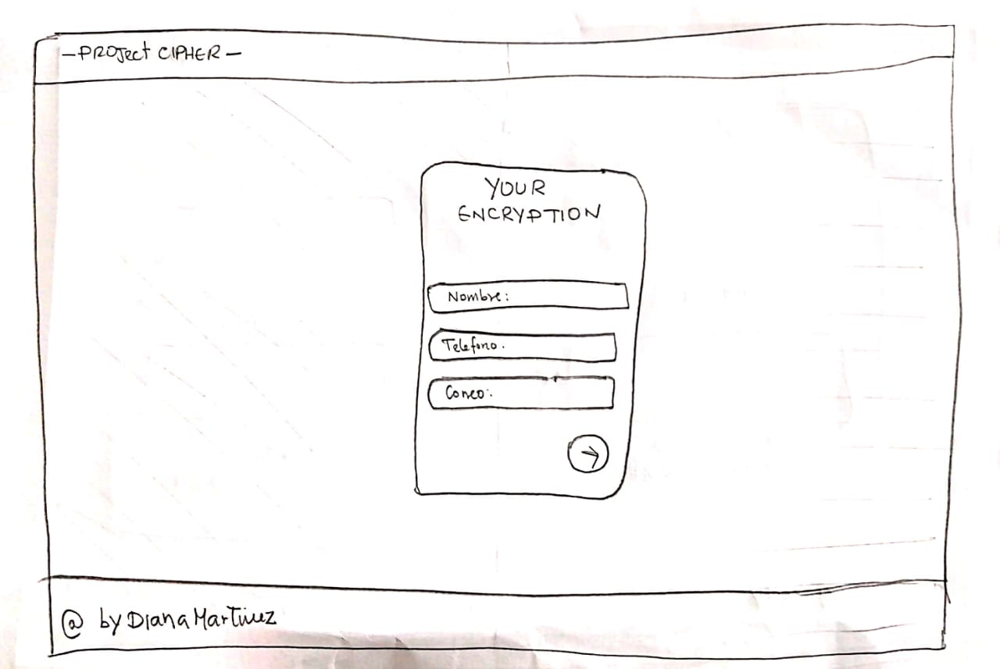
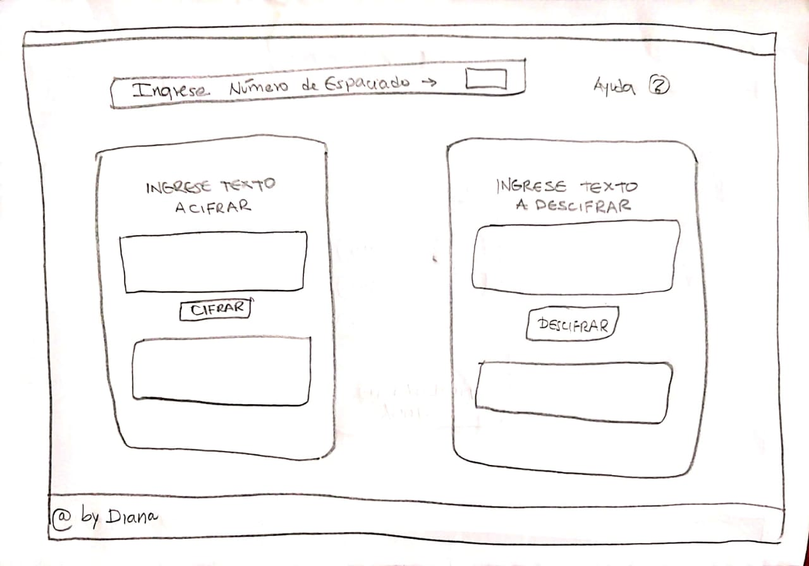
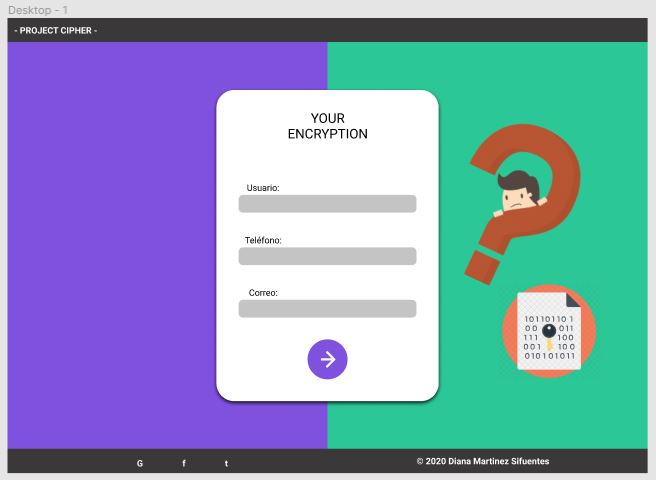
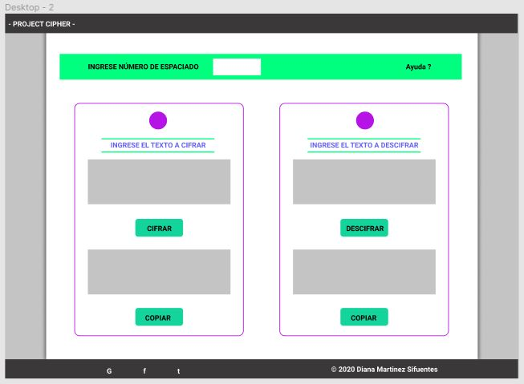

# YOUR ENCRYPTION

El cifrado césar es una de las técnicas más simples para cifrar un mensaje. Es
un tipo de cifrado por sustitución, es decir que cada letra del texto original
es reemplazada por otra que se encuentra un número fijo de posiciones
(desplazamiento) más adelante en el mismo alfabeto.

YOUR ENCRYPTION es una página diseñada para el usuario que desee cifrar un
mensaje y a la vez descifrar un mensaje recibido. La página ofrece todas
las facilidades al usuario para poder manejarla. 

Para más información de la técnica usada, visitar:
--> [cifrado César](https://en.wikipedia.org/wiki/Caesar_cipher)

### <-PRIMERA PANTALLA->

### <-SEGUNDA PANTALLA->

## INVESTIGACIÓN UX

-> Los usuarios sienten la necesidad de enviar información segura a su
receptor, ésta página les resuelve el problema utilizando la técnica
de Cifrado César, para poder enmascarar el mensaje.

# > ¿Cómo resuelve el problema?  <

* El usuario deberá ingresar sus datos en el formulario mostrado, para
  poder acceder a la segunda pantalla
* Todos los campos son obligatorios, al darle siguiente recibirá un mensaje
  en caso no complete todos los campos
* En la segunda pantalla, si el usuario no entiendo como funciona el flujo de
  la página, éste tendrá acceso a la palabra "ayuda", al darle click, se abrirá
  una pantalla explicativa con los pasos a seguir.
* En la parte superior se visualiza un box, para ingresar el número de espaciado
  a recorrer.
* En el box "Ingrese su texto a cifrar", el usuario deberá ingresar el mensaje a
  cifrar, luego darle click en el boton CIFRAR y obtendrá en el segundo box inferior
  el mensaje cifrado.
* El usuario cuenta con un botón COPIAR que realizará la función de copiar el texto
  cifrado.
* En el box "Ingrese su texto a descifrar", el usuario deberá ingresar el mensaje a
  descifrar o ingresar el texto cifrado que copió, luego darle click en el botón 
  DESCIFRAR y obtendrá en el segundo box inferior el mensaje descifrado.
* El usuario cuenta con un botón COPIAR que realizará la función de copiar el texto
  descifrado.
* En ambas columnas, se cuenta con un botón ícono de Refresh, que permitirá al usuario
  limpiar el contenido de los boxs.

### PROTOTIPOS EN BAJA FIDELIDAD

  La primera actividad, fue realizar prototipos en baja fidelidad, luego recibir feedback
  de algunos usuarios al utilizar el prototipo.

  #### --> Primera Pantalla a lápiz y papel

  

  #### --> Segunda Pantalla a lápiz y papel

  

### PROTOTIPOS EN ALTA FIDELIDAD

  La segunda actividad, fue realizar prototipos en alta fidelidad, agregando algunas sugerencias
  del usuario al probar el producto. Los prototipos en Alta Fidelidad se realizaron en FIGMA.

  Se agregó:
    * Un botón que limpie los contenidos del box
    * Se estructuró mejor los inputs de información del usuario
    * Se colocó el botón siguiente en el medio
    * Se agregó botones "COPIAR" para brindarle mayor facilidad al usuario de copiar el
      texto cifrado y/o descifrado
    * En el footer se agregó íconos que me direccionaran a páginas muy buscadas por el 
      usuario (facebook, twiter, gmail)

  
  #### --> Primera Pantalla en Alta Fidelidad

  

  #### --> Segunda Pantalla en Alta Fidelidad

  

## Objetivos de aprendizaje

### UX

* [ ] [Diseñar la aplicación pensando y entendiendo al usuario](https://lms.laboratoria.la/cohorts/lim-2020-01-bc-core-lim012/courses/intro-ux/01-el-proceso-de-diseno/00-el-proceso-de-diseno)
* [ ] [Crear prototipos para obtener feedback e iterar](https://lms.laboratoria.la/cohorts/lim-2020-01-bc-core-lim012/courses/product-design/00-sketching/00-sketching)
* [ ] [Aplicar los principios de diseño visual](https://lms.laboratoria.la/cohorts/lim-2020-01-bc-core-lim012/courses/product-design/01-visual-design/01-visual-design-basics)

### HTML y CSS

* [ ] [Uso correcto de HTML semántico](https://developer.mozilla.org/en-US/docs/Glossary/Semantics#Semantics_in_HTML)
* [ ] [Uso de selectores de CSS](https://developer.mozilla.org/es/docs/Web/CSS/Selectores_CSS)
* [ ] [Construir tu aplicación respetando el diseño realizado](https://lms.laboratoria.la/cohorts/lim-2020-01-bc-core-lim012/courses/css/01-css/02-boxmodel-and-display) (maquetación).

### DOM

* [ ] [Uso de selectores de nodos del DOM](https://lms.laboratoria.la/cohorts/lim-2020-01-bc-core-lim012/courses/browser/02-dom/03-1-dom-methods-selection)
* [ ] [Manejo de eventos del DOM](https://lms.laboratoria.la/cohorts/lim-2020-01-bc-core-lim012/courses/browser/02-dom/04-events)
* [ ] [Manipulación dinámica del DOM](https://developer.mozilla.org/es/docs/Referencia_DOM_de_Gecko/Introducci%C3%B3n)

### Javascript

* [ ] [Manipulación de strings](https://lms.laboratoria.la/cohorts/lim-2020-01-bc-core-lim012/courses/javascript/06-strings/01-strings)
* [ ] [Uso de condicionales](https://lms.laboratoria.la/cohorts/lim-2020-01-bc-core-lim012/courses/javascript/02-flow-control/01-conditionals-and-loops)
* [ ] [Uso de bucles](https://lms.laboratoria.la/cohorts/lim-2020-01-bc-core-lim012/courses/javascript/02-flow-control/02-loops)
* [ ] [Uso de funciones](https://lms.laboratoria.la/cohorts/lim-2019-09-bc-core-lim011/courses/javascript/02-flow-control/03-functions)
* [ ] [Datos atómicos y estructurados](https://www.todojs.com/tipos-datos-javascript-es6/)
* [ ] Utilizar ES Modules (`import` | `export`).

### Testing

* [ ] [Testeo de tus funciones](https://jestjs.io/docs/es-ES/getting-started)

### Git y GitHub

* [ ] [Comandos de git](https://lms.laboratoria.la/cohorts/lim-2019-09-bc-core-lim011/courses/scm/01-git/04-commands)
  (`add` | `commit` | `pull` | `status` | `push`).
* [ ] [Manejo de repositorios de GitHub](https://lms.laboratoria.la/cohorts/lim-2019-09-bc-core-lim011/courses/scm/02-github/01-github)  (`clone` | `fork` | `gh-pages`).

### Buenas prácticas de desarrollo

* [ ] Organizar y dividir el código en módulos (Modularización).
* [ ] Uso de identificadores descriptivos (Nomenclatura | Semántica).
* [ ] Uso de linter para seguir buenas prácticas (ESLINT).